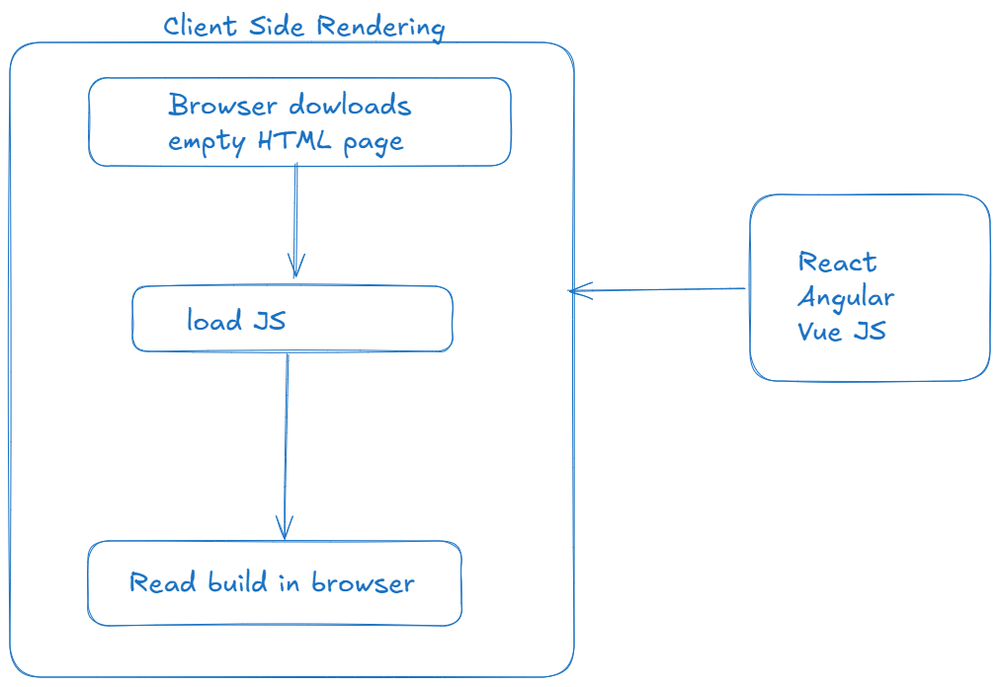
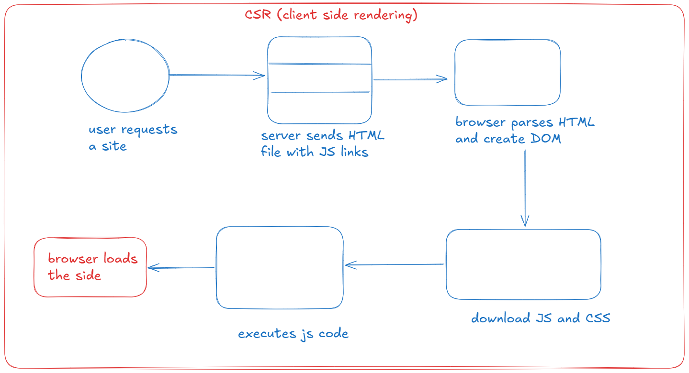
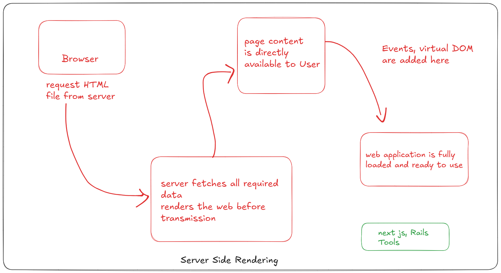
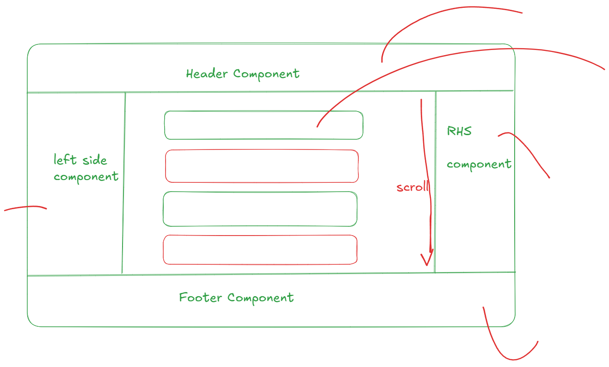

# Frontend Development

- CSR: Renders in Browser

- SSR- renders in Server

- SSG (static Site Generation)

    - load static content
    - likes blogs app, documentaion

## React

- component Based Architecture

