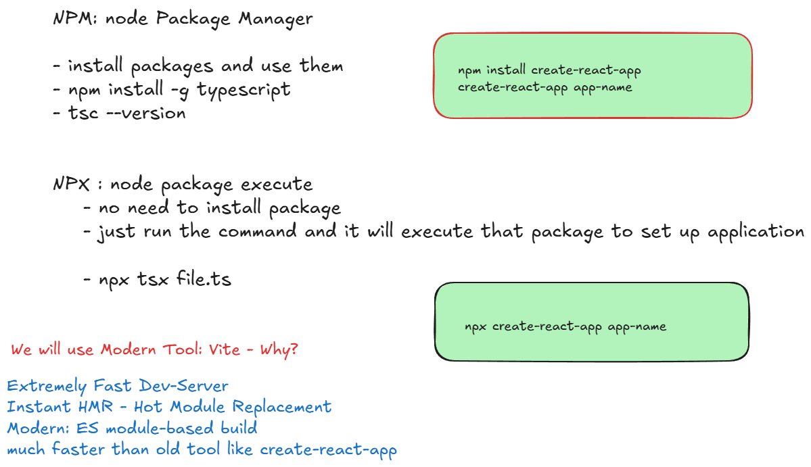
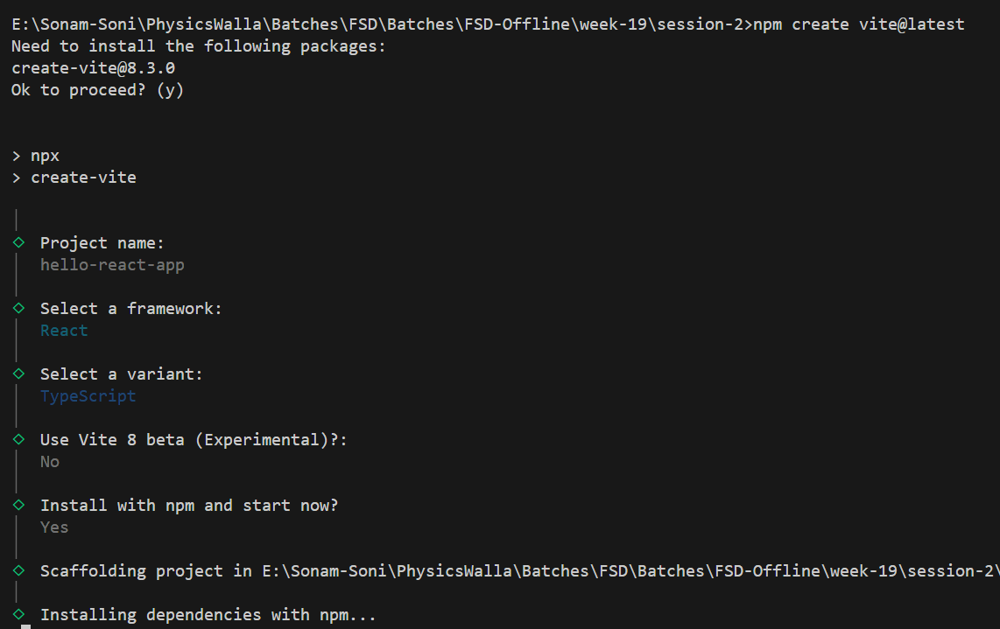
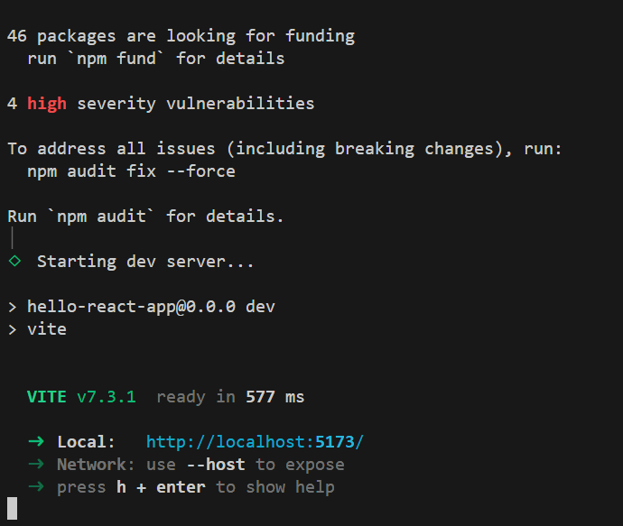

# Create First React App



## Create React App using Vite

[Reference Link](https://vite.dev/guide/)

```bash
npm create vite@latest
```



- After execution



```bash
# to terminate application use ctrl+c
# to start again move to app folder
cd hello-react-app
npm run dev
```

### For Mac Users 

```bash
# Go to Terminal:
cd /Users/Anurag/hello-react-app
sudo chown -R $(whoami) # enter mac password

# delete node-modules and package-lock.json
# under the project folder run: 

npm install
npm run dev
```

- If you want to create application directly

```bash
npm create vite@latest first-app -- --template react-ts
# it understand first-app is the name of application
# react as framework
# ts - typescript as variant
```
