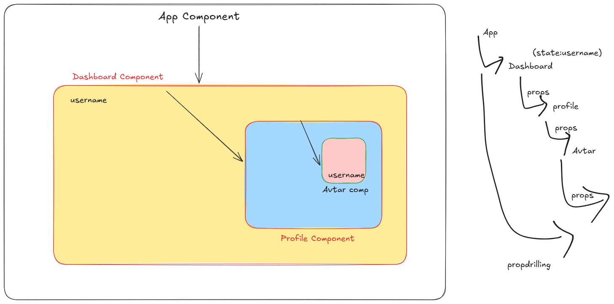
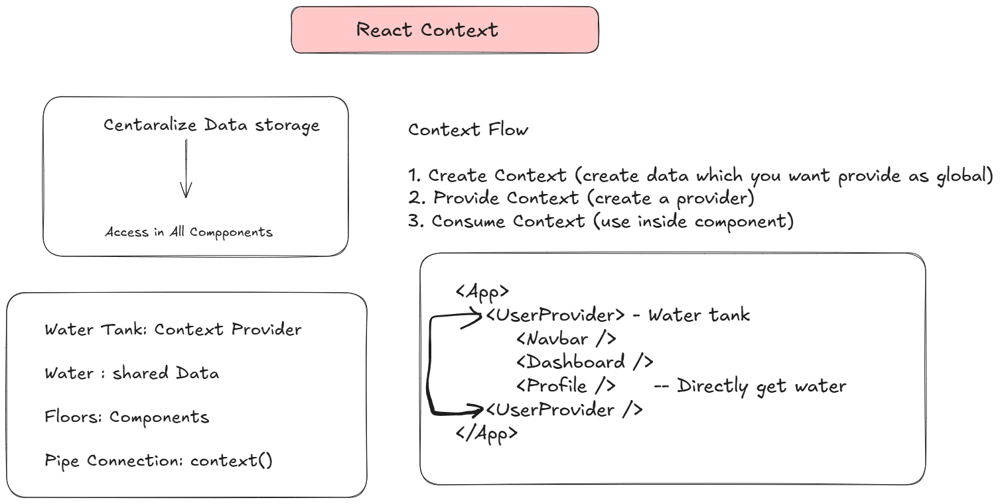

# Props Drilling

- App
  - Dashboard
     - Profile
        - Avatar

- if Avtar component required a data from app or dashboard then we have to pass via props
- passing from app -> dash -> profile -> avatar (PropsDrilling)



**Problems**

- too many props
- difficult to maintain
- components which don't require data still we need to pass via it.

## Solution: Context

- Reactb Context helping us to share data globally.

- Shopping Cart App requires cart data
  - in Cart Component
  - in checkout component
  - in all product page for add item in cart

- same state required to access in multiple components 



## Let's implement

- create folder named context
- create file ThemeContext.tsx

```tsx
import { createContext } from "react";

type ThemeContextType = {
    theme: string;
    toggleTheme: () =>void
}
export const ThemeContext = createContext<ThemeContextType|null>(null);
```

- ThemeProvider.tsx under context folder

```tsx
import { useState } from "react"
import { ThemeContext } from "./ThemeContext"

type Props={
    children: React.ReactNode
}
export const ThemeProvider=({children}:Props)=>{
    const [theme,setTheme] = useState("light")

    const toggleTheme=()=>{
        setTheme(theme==="light"?"dark":"light")
    }

    return (
        <ThemeContext.Provider value={{theme,toggleTheme}}>
            {children}
        </ThemeContext.Provider>
    )
}
```

- update main.tsx to add provider

```tsx
import { ThemeProvider } from './context/ThemeProvider.tsx'

createRoot(document.getElementById('root')!).render(
  <ThemeProvider>
    <App />
  </ThemeProvider>
)
```
- to apply css create file style.css under src/comnponent folder

```css
.light{
    background-color: white;
    color: black;
}
.dark{
    background-color: black;
    color: white;
}
```
- use inside Header Component (Header.tsx)

```tsx
import { useContext } from "react";
import { ThemeContext } from "../context/ThemeContext";
import './style.css'
function Header() {
    const context = useContext(ThemeContext);

    if (!context) return null;
    const { theme } = context //destructing
    return (
        <div className={theme}>
            <h2>Header Component</h2>
            <h3>Theme: {theme}</h3>
        </div>
    );
}

export default Header;
```

- to chnage the theme used Dashboard component

```tsx
import { useContext } from "react";
import Profile from "./Profile";
import { ThemeContext } from "../context/ThemeContext";

function Dashboard() {
    const user = {name: "Sonam Soni"}

    const context = useContext(ThemeContext);
    if(!context) return null;

    const {toggleTheme} = context; //destructing 
    return ( 
        <div style={{border:"2px solid red", padding:"10px"}}>
            <h3>Dashboard Component</h3>
            <Profile name={user.name} />

            <button onClick={toggleTheme}>Change Theme</button>
        </div>
     );
}

export default Dashboard;
```
- means we are using same context in Header as well as Dashboard without using props

### UseReducer Hook

- useReducer hook woks with 3 parts
  + state: current data
  + Action: what you wnat to do
  + Reducer Function: decides how to update state

- const [state,dispatch]= useReducer()(reducer,initialState)

  + state -> current state
  + dispatch -> function to send actions
  + reducer -> function to update state
  + initialState -> stating value


- to work with this hook we need to create ActionsTypes, Reducer, in component use useReducerHook

1. Create folder named types/action.ts file

```ts
export type Action =
    { type: "increment" } |
    { type: "incrementByNum"; payload: number } |
    { type: "decrement" } |
    { type: "decrementByNum"; payload: number } |
    { type: "reset" }
```

2. Create Reducer function under reducers folder

```ts
import type { Action } from "../types/Actions";

//(state,action) -> return a new state
export function reducer(state: number, action: Action): number {
    switch (action.type) {
        case "increment":
            return state + 1;
        case "incrementByNum":
            return state + action.payload
        case "decrement":
            return state - 1;
        case "decrementByNum":
            return state - action.payload;
        case "reset":
            return 0;
        default:
            return state;
    }
}
```

- use under component Counter

```tsx
import { useReducer } from "react";
import { reducer } from "../reducers/Reducuer";

function Counter() {
    const [count, dispatch] = useReducer(reducer, 0);
    return (
        <>
            <h2>Count: {count}</h2>

            <button onClick={() => dispatch({ type: "increment" })}>increment</button>
            <button onClick={() => dispatch({ type: "incrementByNum", payload: 5 })}>incrementBy5</button>
            <button onClick={() => dispatch({ type: "decrement" })}>decrement</button>
            <button onClick={() => dispatch({ type: "decrementByNum", payload:3 })}>decrementBy3</button>
            <button onClick={() => dispatch({ type: "reset" })}>reset</button>
        </>
    );
}

export default Counter;
```

- include component in App.tsx and check output in Browser

### UseCallback

- React.memo: remembers componet not rerender if props not changed
    - control component from rerender

- useCallback: remeber function (not recreate)
    - controlling function
    - usecallback keeps the same function refrences between 2 renders