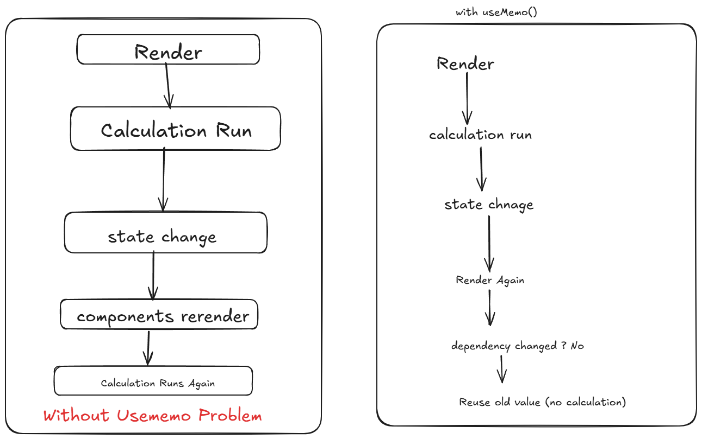
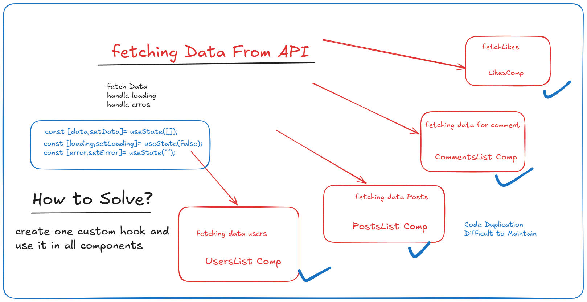
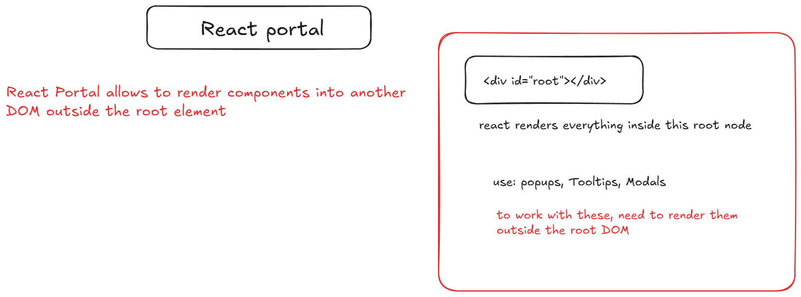

# Use Memo Hook



- create componnet called UseMemoDemo

### Without use memo
```tsx
import { useState } from "react";

function UseMemoDemo() {
    const [count, setCount] = useState<number>(0);
    const [text, setText] = useState<string>("");

    const calculation=(num:number)=>{
        console.log("calculating.......")
        for(let i=0;i<100000000000;i++){
            return num*2;
        }
    }

    const result=calculation(count); //calling calculation

    return (
        <div>
            <h3>Use Memo HookDemo</h3>
            <h4>Conter: {count}</h4>
            <button onClick={()=>setCount(count+1)}>Increment</button>
            <br/><br/>
            <input type="text" placeholder="Type Something"
            value={text} onChange={(e)=>setText(e.target.value)} />
            <h3>Text: {text}</h3>

            <h3>Result: {result}</h3>
        </div>
    );
}

export default UseMemoDemo;
```
- save this component and add it inside App component
- check in browser, everytime when input state is getting changed the bigger calculation is executed without any reason.
- this is actualy downgrading perfomance
- to optimize that use usememo hook
- [] - we can add dependency
- [] empty array means it will calculate only once
- [count]m - calculate only if count state changed 

- now update function calling using below code

```tsx
const result = useMemo(()=>{
        return calculation(count);
    },[count])
```

- check in console 
- if input change then it will not trigger the function but if count changes it will trigger and result will re render.


### Custom Hooks

- understand



- create CustomHook: useCounter.ts

```ts
import { useState } from "react"

export const useCounter = (initialValue: number=0)=>{

    const [count,setCount]=useState<number>(initialValue);

    const increment = ()=>setCount(prev=>prev+1);
    const decrement = ()=>setCount(prev=>prev-1);
    const reset = ()=>setCount(initialValue);

    return {count,increment,decrement,reset}
}
```

- use inside Counter Component

```tsx
import { useCounter } from "./useCounter";

function Counter() {
    const {count,increment,decrement,reset}=useCounter(0);
    return (
        <>
            <h2>Count: {count}</h2>

            <button onClick={increment}>+</button>
            <button onClick={decrement}>-</button>
            <button onClick={reset}>Reset</button>
        </>
      );
}

export default Counter;
```
- include it in App.tsx and check how it works.
- this helkps us to utilize same business logic in multiple components

### portals



- go to index.html add one seperate div
- <div id="modal-root"></div>

# for launching model
- create modal.tsx

```tsx
import ReactDOM from "react-dom"
function Modal() {
    const modalRoot= document.getElementById("modal-root") as HTMLElement;
    return ReactDOM.createPortal(<div style={{
            position: "fixed",
            top:"40%",
            left:"40%",
            background:"white",
            padding:"20px",
            border: "1px solid black"
        }}>
            <h2>Modal Window</h2>
            <p>This is rendering using Portal</p>
        </div>, modalRoot)
}

export default Modal;
```

- render the model based on Condiition update App.tsx

```tsx
import { useState } from "react"
import Modal from "./components/Modal";

function App() {
const [show,setShow]=useState(false);
  return (
    <>
      <button onClick={()=>setShow(true)}>Show Model</button>
      {show && <Modal/>}
    </>
  )
}

export default App
```

- if you want to include Bootstrap Modal

- update bootstrap libraries inside index.html'
- Create BootstrapModel.tsx file

```tsx
import ReactDOM from "react-dom"
function BootstraModal() {
    const modalRoot = document.getElementById("modal-root") as HTMLElement;
    return ReactDOM.createPortal(
        <div>
            
            <div className="modal fade" id="exampleModal" aria-labelledby="exampleModalLabel" aria-hidden="true">
                <div className="modal-dialog">
                    <div className="modal-content">
                        <div className="modal-header">
                            <h1 className="modal-title fs-5" id="exampleModalLabel">Modal title</h1>
                            <button type="button" className="btn-close" data-bs-dismiss="modal" aria-label="Close"></button>
                        </div>
                        <div className="modal-body">
                            Do you want to continue?
                        </div>
                        <div className="modal-footer">
                            <button type="button" className="btn btn-secondary" data-bs-dismiss="modal">Close</button>
                            <button type="button" className="btn btn-primary">Save changes</button>
                        </div>
                    </div>
                </div>
            </div>
        </div>
        , modalRoot)
}

export default BootstraModal;
```

- to include inside app.tsx

```tsx
import { useState } from "react"
import BootstraModal from "./components/BootstrapModal";

function App() {
const [show,setShow]=useState(false);
  return (
    <>
      <button type="button" className="btn btn-primary" data-bs-toggle="modal" data-bs-target="#exampleModal" onClick={()=>setShow(true)}>
                Launch demo modal
            </button>
      {show && <BootstraModal />}
    </>
  )
}

export default App

```