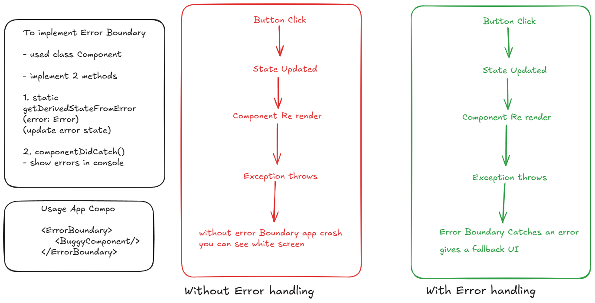

# Error Handling using Error Boundary



- create Buggy Component
- Create ErrorBoundary
- use Error Boundary in App.tsx

# Implement React Router

- install dependency
- npm install react-router-dom

- create 3 coponents under pages folder
- Home (home.tsx)
- About (about.tsx)
- Contact (contact.tsx)

- go to App.tsx and add BrowserRouter for creating route
- these routes are accessible now
- http://localhost:5173/about
- http://localhost:5173/contact

- to acess by clicking on Link create component called
- Navbar.tsx
- create links and add Navbar in app.tsx under browser router and try to click on links and check it routes the page or not

## Implementing Dynamic Route

- creating router for details page
- /users/1
- /users/2

- Create Users Compnent for Fetching Data
- create type for user, user.ts

```ts
export interface User{
    id: number,
    name: string,
    email: string,
    username:string,
    phone:string,
    website:string
}
```

- Users.tsx (List Component)
```tsx
import { useEffect, useState } from "react";
import type { User } from "../Types/user";
import { Link } from "react-router-dom";

function Users() {
    const [users,setUsers]=useState<User[]>([])
    useEffect(()=>{
        fetch("https://jsonplaceholder.typicode.com/users")
        .then(res=>res.json())
        .then(data=>setUsers(data))
        .catch(err=>console.log(err))
    },[])
    return ( 
        <>
            <h2>User's List</h2>
            {
                users.map(user=>(
                    <div key={user.id}>
                        <Link to={`/users/${user.id}`}>{user.name}</Link>
                    </div>
                ))
            }
        </>
     );
}

export default Users;
```

- For Creating Dynamic Details Component
- UserDetails.tsx

```tsx
import { useNavigate, useParams } from "react-router-dom";
import type { User } from "../Types/user";
import { useEffect, useState } from "react";

type ParamType = {
    id: string
}
function UserDetails() {
    const { id } = useParams<ParamType>()
    const [user, setUser] = useState<User | null>(null)
    const navigate=useNavigate();
    
    useEffect(() => {
        fetch(`https://jsonplaceholder.typicode.com/users/${id}`)
            .then(res => res.json())
            .then(data => setUser(data))
            .catch(err => console.log(err))
    }, [id]) //if id changes useEffect hook triggers
    if(!user) return <p>Loading....</p>
    return (
        <>
            <h2>User Details</h2> <hr />
            <p><b>Name:</b> {user.name}</p>
            <p><b>Username:</b> {user.username}</p>
            <p><b>Email ID:</b> {user.email}</p>
            <p><b>Phone:</b> {user.phone}</p>
            <p><b>Website:</b> {user.website}</p>

            <button onClick={()=>navigate(-1)}>Back</button>
        </>
    );
}

export default UserDetails;
```

- create Links inside App.tsx

```tsx
<Route path="/users" element={<Users />} />
<Route path="/users/:id" element={<UserDetails />} />
```

- only add Users link in navbar.tsx
- <Link to="/users">UserList</Link>